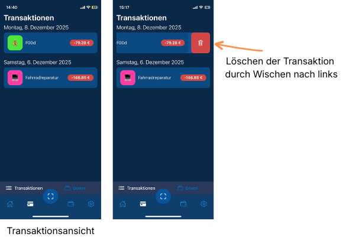
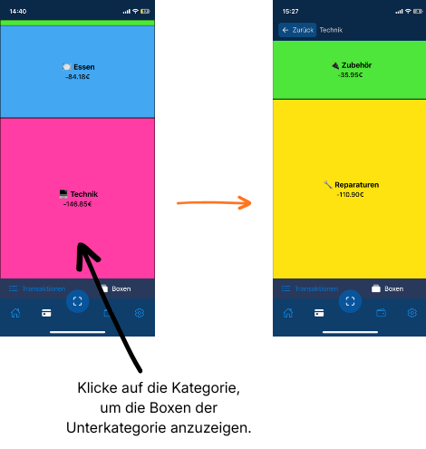
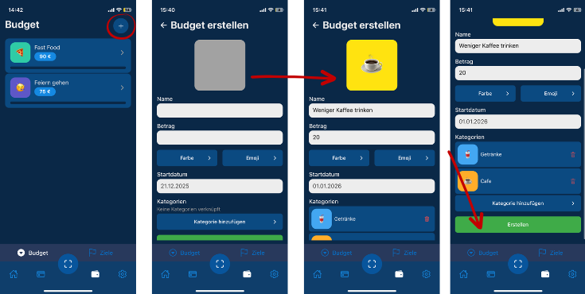
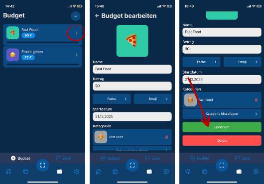
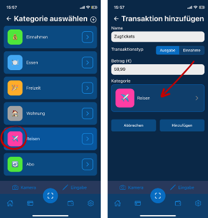

= Anwenderdokumentation
:toc:
:toc-title: Inhaltsverzeichnis
:toclevels: 2

= Einstieg
Du weißt nicht wie du Spendex benutzen sollst oder hast eine Frage zu einem konkreten Feature? Dann helfen wir dir ohne großes Prosa hier weiter.

= Schnellstart
In diesem Kapitel kannst du nachlesen wie du in unter einer Minute die App arbeitsfähig machen kannst.

1. Starte die App - noch siehst du ein recht leeres Fenster.
2. Bevor du loslegst, benötigst du einen oder mehrere *Accounts*. Das ist sozusagen dein Geldbeutel in dem sich ein 50 EUR Schein befindet oder dein Girokonto auf dem Summe X ist. Möchtest du später eine Ausgabe dokumentieren, musst du angeben aus welchem Account Geld geflossen ist. 
Wechsle zu den _Einstellungen > Konten verwalten > +_ > Gib einen Namen, eine Farbe und ein Emoji und dein Guthaben ein.
3. Du kannst mit einem *vorgefertigten Kategorienbaum* starten. Dieser ist bereits auf Studierende zugeschnitten. Wenn du eine Ausgabe machst, werden je nach Posten auf dem Kassenzettel dann diese zu einer oder mehreren Kategorien zugeordnet. Hierfür musst du nichts tun.
4. Für das *Dokumentieren einer Ausgabe* wähle den Scan-Button in der unteren Leiste. Wähle zwischen einer Sofort-Fotoaufnahme, einem Import aus der Galerie oder einer manuellen Eingabe (mehr dazu siehe Features). 
5. Nachdem du deine Ausgabe gespeichert hast, siehst du sie in dem Reiter Transaktionen.

= Überblick über die Benutzeroberfläche

== Home

[align=center]
.Überblick über die ersten drei Benutzeroberflächen
image::images/Home.png[width=25%] 

Das Home-Menü ist der erste Einstiegspunkt. In dieser Version wird hier der Kontostand angezeigt. Die Anzeige dessen setzt voraus, dass in _Einstellungen > Accounts verwalten_ ein Account mit einem Budget hinterlegt ist.

== Transaktionen
[[fig-delete]]
[align=center]
.Übersicht und Löschen von Transaktionen
 

In den Transaktionen werden die getätigten Ausgaben und Einnahmen chronologisch angezeigt. Angezeigt wird der Name der Transaktion, die Kategorie in der die meisten Posten der Transaktion gespeichert sind und der Betrag. Du kannst einzelne Transaktionen löschen, indem du von rechts nach links wischst.

== Boxen
[[fig-box]]
[align=center]
.Boxen-Ansicht
 

Die Boxen sind ein kleines Analysetool. Anhand der bisher getätigten Ausgaben wird die Größenverteilung der Kategorien angezeigt. Du kannst auf einzelne Boxen klicken, um deren Unterkategorie in Boxen dir anzeigen zu lassen.

Das heißt, je größer eine Box, desto größer sind die zugehörigen Ausgaben.

== Budget
[align=center]
.Option Budget
image::images/Budget.png[width=25%] 

Mit der Budget-Funktion kannst du für bestimmte Kategorien ein monatliches Ausgabenlimit festlegen und deine Ausgaben gezielt kontrollieren.

Sobald Ausgaben in einer zugeordneten Kategorie erfasst werden, werden diese automatisch dem Budget angerechnet. Der Fortschritt wird visuell über einen Balken dargestellt, der sich entsprechend der Höhe der Ausgaben füllt. Je näher die Gesamtausgaben dem festgelegten Budget kommen, desto stärker ist der Balken gefüllt.

Auf diese Weise ist jederzeit ersichtlich, wie viel vom Budget bereits verbraucht wurde und wie viel Spielraum noch zur Verfügung steht.

== Einstellungen

[align=center]
.Einstellungen Ansicht
image::images/Einstellungen.png[width=25%] 

In den Einstellungen kannst du grundlegende Optionen der App individuell konfigurieren. Dazu gehören die Verwaltung von Kategorien und Konten sowie persönliche Anpassungen der Darstellung.

Unter dem Bereich Personalisierung kannst du zwischen einem hellen und einem dunklen Erscheinungsbild wählen und die Sprache der App auf Deutsch oder Englisch umstellen. Änderungen werden direkt übernommen und gelten für die gesamte App.

= Überblick über die wichtigsten Funktionen
== Ausgabe mittels Kamera oder Galerie-Import erfassen
== Manuelle Ausgabe erstellen

== Budget-Ziel erstellen, ändern oder löschen
[align=center]
.Budget erstellen
 

Möchtest du ein neues Budget-Ziel erstellen, folgst du ganz einfach diesen Schritten:
1. Wechsle zu Budget in der Menüleiste
2. Klicke auf das +, um ein neues Budget zu erstellen.
3. Füge Namen, den Betrag, den du für das Budget ausgeben möchtest sowie ein Startdatum und zugehörige Kategorien hinzu. Vergebe optional eine Farbe und ein Emoji.
4. Klicke auf "Erstellen".

[align=center]
.Budget löschen oder ändern
 

Fast denselben Weg wählst du, wenn du ein Budget ändern oder löschen möchtest:
1. Klicke auf das bestehende Budgetziel.
2. Scrolle nach unten um das Budget zu löschen oder klicke auf einzelne Felder, um diese zu bearbeiten.

== Kategorien verwalten

= FAQ
*F:* Wie lösche ich eine getätigte Ausgabe?

*A:* Im Reiter Transaktionen kannst du durch Wischen nach links die Kategorie löschen. Das siehst du auch in diesem Bild <<fig-delete>>.

__

*F:* Wie kann ich nur die Oberkategorie für eine Transaktion auswählen ohne den ganzen Kategoriebaum zu durchlaufen?

*A:* Nehmen wir an du hast Zugtickets gekauft, aber möchtest sie nur der Kategorie "Reisen" zuordnen ohne eine extra Unterkategorie in "Reisen" für Zugtickets zu erstellen. Dann klickst du einfach auf das Icon der Oberkategorie und hast diese schon ausgewählt.

[align=center]
.Oberkategorie auswählen
 

__

*F:* Was ist ein Konto?

*A:* Ein Konto ist eine Art Guthaben. Du kannst beispielsweise ein Konto "Girokonto" erstellen, welches deinen Kontostand abbildet. Tätigst du Ein- und Ausgaben verändert sich dein Kontostand - so wie es im echten Leben auch dein Girokonto tut. Im Home-Menü siehst du jederzeit deinen Kontostand. Wenn du möchtest, kannst du mehrere Konten erstellen und bei jeder Ausgabe/Einnahme entscheiden von wo das Geld fließt.

__

*F:* Was ist eine Kategorie?

*A:* Kategorien sind Rubriken nach denen du Ausgaben klassifizieren kannst. Kategorien ermöglichen dir weiterhin kleine Analysen (Boxen) oder Budget-Ziele zu konfigurieren. Durch die KI-Analyse kannst du sowohl Ober- als auch spezifische Unterkategorien erstellen. Denn es ist möglich pro Transaktion die darin befindlichen Posten unterschiedlichen Kategorien zuzuordnen. Wenn du einkaufen gehst, kaufst du schließlich nicht nur Nudeln, sondern auch Getränke, Schokolade oder Waschmittel. Je nach Belieben kannst du diese Posten unterschiedlichen Unterkategorien zuordnen.

__

*F:* Was zeigen mir die Boxen?

*A:* Die Boxen zeigen dir die Größenverteilung aller Kategorien. Je größer eine Kategorie, desto mehr Ausgaben sind in dieser Kategorie getätigt worden. In der Standardansicht siehst du nur Oberkategorien. Du kannst auf die entsprechende Oberkategorie klicken, um die Größenverteilung der darin befindlichen Unterkategorien dir anzeigen zu lassen. Das siehst du auch hier: <<fig-box>>.

